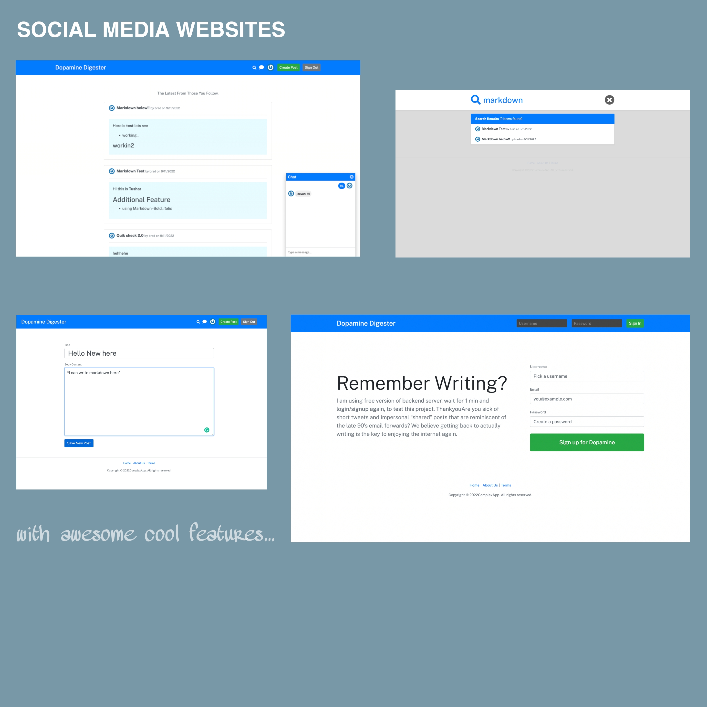

# Social Media website Using ReactJs | MongoDB

## [Check it live here](https://dopamain-digester.netlify.app/)



Dopamine Digester | Social-media website build using React and Firebase.

## Tech Info of App

- React for UI
- MongoDB as DB
- React Router for Routing
- CSS for styling
- MUI

## Features

- login/SignUp
- Follow/unFollow
- Search
- chat
- create post
- delete post
- edit post
- feed

## Getting Started

These instructions will get you a copy of the project up and running on your local machine for development and testing purposes. See deployment for notes on how to deploy the project on a live system.

### Installing

Clone the Repository and run

```
npm i
npm run dev
```

## Deployment

To deploy simply run

```
npm run build
```

## Built With

- React JS
- React-Router
- MongoDB
- React context

## Contributing

Please feel free to send pull request if you want to contribute!
